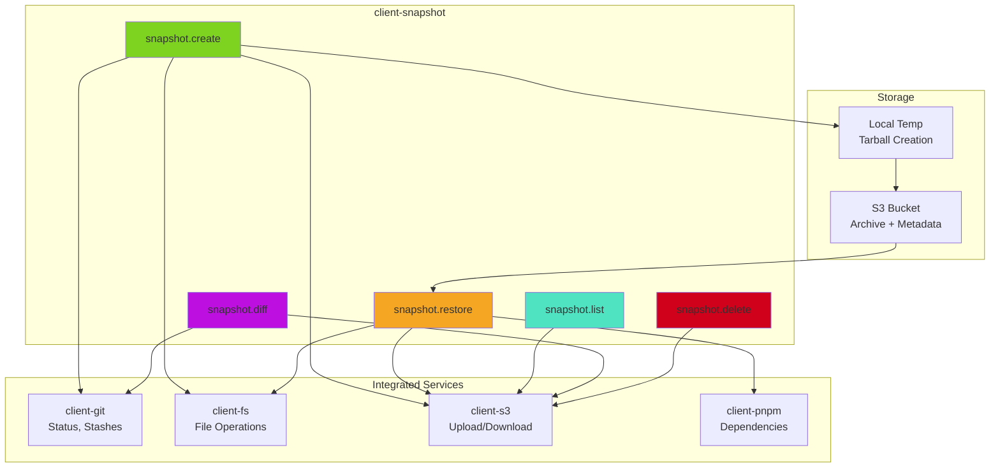
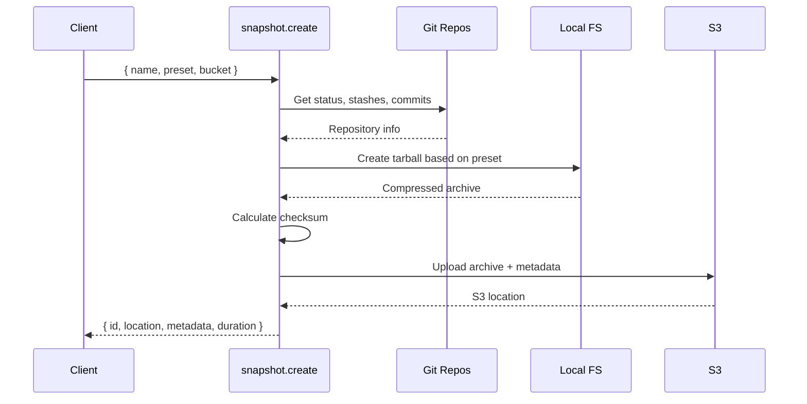

# @mark1russell7/client-snapshot

[](https://www.npmjs.com/package/@mark1russell7/client-snapshot)
[](https://opensource.org/licenses/MIT)

> Environment snapshot/restore procedures for testing and recovery

## Overview

`client-snapshot` provides comprehensive procedures for capturing and restoring complete development environment snapshots. It supports multiple preset levels (light, medium, heavy) to balance snapshot size vs. completeness, integrates with S3 for cloud storage, and orchestrates multiple client packages for Git, filesystem, and package management operations.

### Key Features

- **Multi-Level Presets**: Light (Git only ~500MB), Medium (+ node_modules ~2GB), Heavy (+ pnpm store ~10GB+)
- **Cloud Storage**: S3 integration for remote snapshot storage and sharing
- **Complete State Capture**: Git repos, branches, stashes, working trees, dependencies, and more
- **Intelligent Diffing**: Compare current state against snapshots to track changes
- **Multipart Upload**: Handles large snapshots with efficient S3 multipart uploads
- **Rich Metadata**: Captures environment info, repository state, checksums for verification
- **Restore Safety**: Configurable overwrite protection and target path options

## Architecture



### Snapshot Flow



## Installation

```bash
npm install @mark1russell7/client-snapshot
```

Or with pnpm:

```bash
pnpm add @mark1russell7/client-snapshot
```

### Dependencies

This package depends on:
- `@mark1russell7/client` - Core client/procedure system
- `@mark1russell7/client-s3` - S3 storage operations
- `@mark1russell7/client-git` - Git repository operations
- `@mark1russell7/client-pnpm` - Package manager operations
- `@mark1russell7/client-fs` - Filesystem operations
- `zod` - Schema validation
- `tar` - Archive creation and extraction

### External Requirements

- **AWS Credentials**: Configured for S3 access (via environment or AWS CLI)
- **Git**: For repository state capture
- **pnpm** (optional): For full dependency restoration
- **Node.js >=20**: Required for all operations

## Usage

### Creating Snapshots

```typescript
import { Client } from "@mark1russell7/client";

const client = new Client(/* ... */);

// Create a lightweight snapshot (Git repos only)
const result = await client.call(["snapshot", "create"], {
  name: "feature-auth-impl",
  preset: "light",
  bucket: "my-snapshots",
  description: "Before refactoring authentication",
});

console.log(result);
// {
//   id: "feature-auth-impl-1234567890-abc123",
//   location: "s3://my-snapshots/snapshots/feature-auth-impl/...",
//   metadata: {
//     id: "feature-auth-impl-1234567890-abc123",
//     name: "feature-auth-impl",
//     preset: "light",
//     createdAt: "2025-01-15T10:30:00.000Z",
//     environment: {
//       os: "linux",
//       nodeVersion: "v20.0.0",
//       pnpmVersion: "8.15.0",
//       username: "developer",
//       hostname: "dev-machine"
//     },
//     repositories: [
//       {
//         path: "/path/to/repo",
//         name: "@my/package",
//         branch: "feature/auth",
//         commit: "abc123...",
//         dirty: true,
//         stashCount: 2,
//         ahead: 3,
//         behind: 0
//       }
//     ],
//     checksum: "sha256:...",
//     archiveSize: 524288000,
//     description: "Before refactoring authentication"
//   },
//   uploadDuration: 15234
// }
```

### Snapshot Presets

Choose the right preset for your needs:

```typescript
// Light: ~500MB - Git repos only (fast, good for code snapshots)
await client.call(["snapshot", "create"], {
  name: "quick-checkpoint",
  preset: "light",
  bucket: "my-snapshots",
});

// Medium: ~2GB - Git + node_modules (good for reproducible builds)
await client.call(["snapshot", "create"], {
  name: "stable-state",
  preset: "medium",
  bucket: "my-snapshots",
});

// Heavy: ~10GB+ - Everything including pnpm store (full recovery)
await client.call(["snapshot", "create"], {
  name: "complete-backup",
  preset: "heavy",
  bucket: "my-snapshots",
});
```

### Listing Snapshots

```typescript
// List all snapshots
const list = await client.call(["snapshot", "list"], {
  bucket: "my-snapshots",
});

console.log(list);
// {
//   snapshots: [
//     {
//       id: "feature-auth-impl-1234567890-abc123",
//       name: "feature-auth-impl",
//       preset: "light",
//       createdAt: "2025-01-15T10:30:00.000Z",
//       size: 524288000,
//       os: "linux"
//     },
//     // ...
//   ],
//   count: 5
// }

// Filter by prefix
const filtered = await client.call(["snapshot", "list"], {
  bucket: "my-snapshots",
  prefix: "feature-",
  maxResults: 10,
});
```

### Restoring Snapshots

```typescript
// Restore to original locations
const restore = await client.call(["snapshot", "restore"], {
  id: "feature-auth-impl-1234567890-abc123",
  bucket: "my-snapshots",
  overwrite: false, // Safety: don't overwrite existing files
});

console.log(restore);
// {
//   success: true,
//   metadata: { ... },
//   restoredPaths: [
//     "/path/to/repo",
//     "/path/to/another-repo"
//   ],
//   downloadDuration: 8234,
//   extractDuration: 3456
// }

// Restore to different location
await client.call(["snapshot", "restore"], {
  id: "feature-auth-impl-1234567890-abc123",
  bucket: "my-snapshots",
  targetPath: "/tmp/restored",
  overwrite: true,
});
```

### Comparing Against Snapshots

```typescript
// Diff current state vs snapshot
const diff = await client.call(["snapshot", "diff"], {
  id: "feature-auth-impl-1234567890-abc123",
  bucket: "my-snapshots",
});

console.log(diff);
// {
//   snapshotMetadata: { ... },
//   repositories: [
//     {
//       path: "/path/to/repo",
//       branchDiff: {
//         current: "main",
//         snapshot: "feature/auth"
//       },
//       commitDiff: {
//         current: "xyz789...",
//         snapshot: "abc123..."
//       },
//       filesChanged: 15,
//       newStashes: 1
//     }
//   ],
//   summary: {
//     reposChanged: 1,
//     totalFilesChanged: 15,
//     isMatch: false
//   }
// }

// Check specific paths only
const partialDiff = await client.call(["snapshot", "diff"], {
  id: "snapshot-id",
  bucket: "my-snapshots",
  paths: ["/path/to/specific/repo"],
});
```

### Deleting Snapshots

```typescript
// Delete a snapshot
const deleted = await client.call(["snapshot", "delete"], {
  id: "old-snapshot-1234567890-xyz789",
  bucket: "my-snapshots",
});

console.log(deleted);
// {
//   deleted: true,
//   id: "old-snapshot-1234567890-xyz789"
// }
```

## API Reference

### Procedures

#### `snapshot.create`

Create an environment snapshot and upload to S3.

**Input:**
```typescript
{
  name: string;              // Required: Snapshot name
  preset?: SnapshotPreset;   // Default: "medium" ("light" | "medium" | "heavy")
  bucket: string;            // Required: S3 bucket name
  paths?: string[];          // Specific paths to include (default: all ecosystem repos)
  description?: string;      // Optional description
}
```

**Output:**
```typescript
{
  id: string;                // Unique snapshot ID
  location: string;          // S3 location (s3://bucket/key)
  metadata: SnapshotMetadata;
  uploadDuration: number;    // Milliseconds
}
```

#### `snapshot.restore`

Restore environment from S3 snapshot.

**Input:**
```typescript
{
  id: string;                // Required: Snapshot ID
  bucket: string;            // Required: S3 bucket name
  targetPath?: string;       // Restore to different location
  overwrite?: boolean;       // Default: false - safety protection
}
```

**Output:**
```typescript
{
  success: boolean;
  metadata: SnapshotMetadata;
  restoredPaths: string[];   // Paths that were restored
  downloadDuration: number;  // Milliseconds
  extractDuration: number;   // Milliseconds
}
```

#### `snapshot.list`

List available snapshots in S3 bucket.

**Input:**
```typescript
{
  bucket: string;            // Required: S3 bucket name
  prefix?: string;           // Filter by name prefix
  maxResults?: number;       // Default: 100
}
```

**Output:**
```typescript
{
  snapshots: SnapshotListEntry[];
  count: number;
}

// SnapshotListEntry
{
  id: string;
  name: string;
  preset: SnapshotPreset;
  createdAt: string;         // ISO timestamp
  size: number;              // Bytes
  os: string;                // Platform it was created on
}
```

#### `snapshot.diff`

Compare current state against a snapshot.

**Input:**
```typescript
{
  id: string;                // Required: Snapshot ID
  bucket: string;            // Required: S3 bucket name
  paths?: string[];          // Compare specific paths only
}
```

**Output:**
```typescript
{
  snapshotMetadata: SnapshotMetadata;
  repositories: SnapshotDiffRepository[];
  summary: {
    reposChanged: number;
    totalFilesChanged: number;
    isMatch: boolean;        // true if no differences
  };
}

// SnapshotDiffRepository
{
  path: string;
  branchDiff?: { current: string, snapshot: string };
  commitDiff?: { current: string, snapshot: string };
  filesChanged: number;
  newStashes: number;
}
```

#### `snapshot.delete`

Delete a snapshot from S3.

**Input:**
```typescript
{
  id: string;                // Required: Snapshot ID
  bucket: string;            // Required: S3 bucket name
}
```

**Output:**
```typescript
{
  deleted: boolean;
  id: string;
}
```

## Types

### SnapshotMetadata

Complete metadata stored with each snapshot:

```typescript
interface SnapshotMetadata {
  id: string;
  name: string;
  preset: SnapshotPreset;
  createdAt: string;         // ISO timestamp
  environment: {
    os: string;              // win32, darwin, linux
    nodeVersion: string;
    pnpmVersion: string;
    username: string;
    hostname: string;
  };
  repositories: RepositoryInfo[];
  checksum: string;          // SHA-256
  archiveSize: number;       // Bytes
  description?: string;
}
```

### RepositoryInfo

Per-repository state information:

```typescript
interface RepositoryInfo {
  path: string;              // Relative to snapshot root
  name: string;              // Package name
  branch: string;            // Current branch
  commit: string;            // HEAD commit hash
  dirty: boolean;            // Working tree has changes
  stashCount: number;        // Number of stashes
  remoteUrl?: string;        // Remote origin URL
  ahead: number;             // Commits ahead of remote
  behind: number;            // Commits behind remote
}
```

### SnapshotPreset

```typescript
type SnapshotPreset = "light" | "medium" | "heavy";

// Preset Details:
// - light:  Git repos only (.git, working tree, branches, stashes)        ~500MB
// - medium: + node_modules + pnpm lockfiles                              ~2GB
// - heavy:  + pnpm store + global installs + configs                     ~10GB+
```

## Use Cases

### 1. Feature Branch Snapshots

```typescript
// Before starting risky refactor
await client.call(["snapshot", "create"], {
  name: `before-refactor-${Date.now()}`,
  preset: "medium",
  bucket: "team-snapshots",
  description: "Safe state before authentication refactor",
});

// After refactor, compare
const diff = await client.call(["snapshot", "diff"], {
  id: "snapshot-id",
  bucket: "team-snapshots",
});

if (diff.summary.totalFilesChanged > 100) {
  console.warn("Large changes detected!");
}
```

### 2. CI/CD Reproducible Builds

```typescript
// In CI pipeline - capture exact build state
await client.call(["snapshot", "create"], {
  name: `build-${process.env.CI_COMMIT_SHA}`,
  preset: "medium",
  bucket: "ci-snapshots",
});

// Later - restore exact build environment
await client.call(["snapshot", "restore"], {
  id: `build-${commitSha}`,
  bucket: "ci-snapshots",
  targetPath: "/tmp/build",
});
```

### 3. Team Environment Sharing

```typescript
// Developer creates snapshot
await client.call(["snapshot", "create"], {
  name: "onboarding-2025-01",
  preset: "heavy",
  bucket: "team-snapshots",
  description: "Complete setup for new team members",
});

// New team member restores
await client.call(["snapshot", "restore"], {
  id: "onboarding-2025-01-...",
  bucket: "team-snapshots",
  targetPath: "/home/newdev/workspace",
});
```

### 4. Disaster Recovery

```typescript
// Daily backup
await client.call(["snapshot", "create"], {
  name: `daily-${new Date().toISOString().split('T')[0]}`,
  preset: "heavy",
  bucket: "backups",
});

// After disaster - full restore
await client.call(["snapshot", "restore"], {
  id: "daily-2025-01-14-...",
  bucket: "backups",
  overwrite: true,
});
```

## Advanced Usage

### Custom Snapshot Paths

```typescript
// Snapshot specific repositories only
await client.call(["snapshot", "create"], {
  name: "critical-services",
  preset: "medium",
  bucket: "my-snapshots",
  paths: [
    "/workspace/api-gateway",
    "/workspace/auth-service",
    "/workspace/payment-service",
  ],
});
```

### Snapshot Rotation

```typescript
// List and delete old snapshots
const list = await client.call(["snapshot", "list"], {
  bucket: "my-snapshots",
  prefix: "daily-",
  maxResults: 100,
});

// Keep last 7, delete older
const toDelete = list.snapshots
  .sort((a, b) => new Date(b.createdAt).getTime() - new Date(a.createdAt).getTime())
  .slice(7);

for (const snapshot of toDelete) {
  await client.call(["snapshot", "delete"], {
    id: snapshot.id,
    bucket: "my-snapshots",
  });
}
```

### Verification Before Restore

```typescript
// Check what would change before restore
const diff = await client.call(["snapshot", "diff"], {
  id: "snapshot-id",
  bucket: "my-snapshots",
});

if (!diff.summary.isMatch) {
  console.log(`Will modify ${diff.summary.reposChanged} repositories`);
  console.log(`${diff.summary.totalFilesChanged} files will change`);

  // Prompt user for confirmation
  const confirmed = await askUserConfirmation();

  if (confirmed) {
    await client.call(["snapshot", "restore"], {
      id: "snapshot-id",
      bucket: "my-snapshots",
      overwrite: true,
    });
  }
}
```

## Performance Considerations

- **Preset Selection**: Use lightest preset that meets your needs
  - `light` for code-only snapshots (fast, small)
  - `medium` for reproducible builds
  - `heavy` for complete disaster recovery
- **Multipart Upload**: Automatically used for files > 5MB
- **Compression**: Gzip level varies by preset (9 for light/medium, 6 for heavy)
- **Parallel Operations**: Repository info gathering runs in parallel
- **S3 Regions**: Use bucket in same region as compute for faster transfers

## Error Handling

```typescript
try {
  await client.call(["snapshot", "create"], {
    name: "my-snapshot",
    preset: "medium",
    bucket: "my-snapshots",
  });
} catch (error) {
  if (error.message.includes("NoSuchBucket")) {
    console.error("S3 bucket does not exist");
  } else if (error.message.includes("AccessDenied")) {
    console.error("Insufficient S3 permissions");
  } else if (error.message.includes("Not a git repository")) {
    console.error("Path is not a git repository");
  } else {
    console.error("Snapshot failed:", error);
  }
}
```

## Integration with Ecosystem

### With bundle-dev

```typescript
import "@mark1russell7/bundle-dev/register.js";

// snapshot.* procedures available
await client.call(["snapshot", "create"], { ... });
```

### With client-s3

`client-snapshot` uses `client-s3` for all S3 operations:
- Multipart uploads for large archives
- Metadata storage as separate JSON objects
- Bucket operations and listing

### With client-git

Captures comprehensive Git state:
- Current branch and commit
- Working tree status (dirty/clean)
- Stash list and counts
- Remote tracking information
- Ahead/behind commit counts

## License

MIT

## Related Packages

- `@mark1russell7/client` - Core client/procedure system
- `@mark1russell7/client-s3` - S3 storage operations
- `@mark1russell7/client-git` - Git repository operations
- `@mark1russell7/client-pnpm` - Package manager operations
- `@mark1russell7/client-fs` - Filesystem operations
- `@mark1russell7/bundle-dev` - Development bundle
